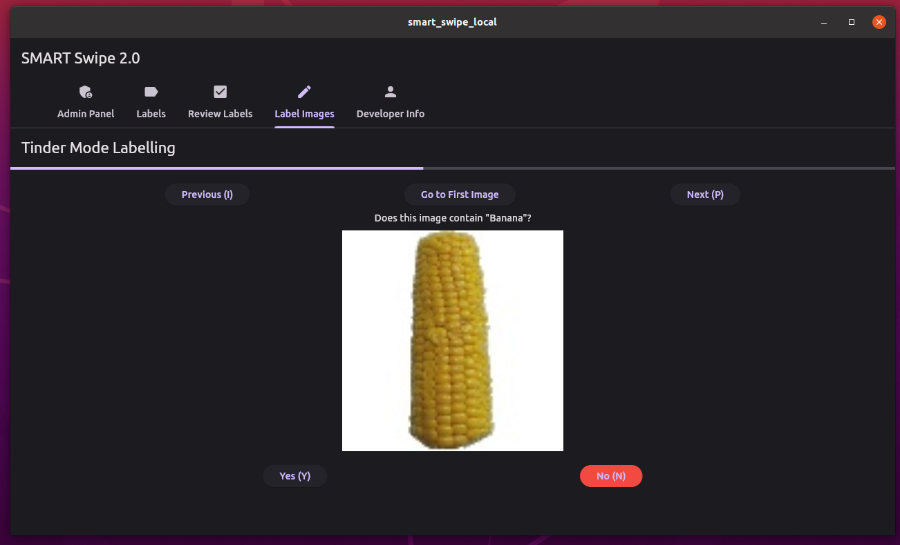

# SMART Swipe - A fast labelling tool for AI image datasets
**Author :** [Pi Ko](https://paingthet.com/) ([pk2269@nyu.edu](mailto:pk2269@nyu.edu))


[](https://forthebadge.com)

[](https://forthebadge.com) 
[](https://forthebadge.com)

SMART Swipe is a fast labelling tool for AI image datasets written in Flutter. It runs locally without any dependency, with an intuitive interface.



## Running the Software

First download this entire repository to your computer.

Then just run the built linux binary in
```
./build/linux/x64/release/bundle/smart_swipe_local 
```

**Supported Image Formats** : 'png', 'jpg', 'jpeg', 'gif', 'bmp', 'webp'

**⚠️ IMPORTANT** : If the original image file size is too large, the software may not be able to load the image. In that case, please resize the image to a smaller size before loading.

**Key Bindings:** To make the labelling process quicker, the user can use I and P keys to navigate between the images, and Y and N to label the image as Yes or No.

After labelling, the labels are saved as text file with the same name as image file in the same directory as the image folder.

## Modifying the Software

### Development Setup

To edit and compile the binary, follow the flutter installation tutorial for Linux at https://docs.flutter.dev/get-started/install/linux

Then get the Flutter extension on Visual Studio Code, and open the project folder.

Then, install all the dependencies by running

```
flutter pub get
```

Then, you can run the app on your device by running

```
flutter run
```

### Building Binary

Add Desktop support to the Flutter App by Running

```
flutter create --platforms=windows,macos,linux .
```

Then clear previous build artifacts by running
```
flutter clean
```

To build the binary, run

```
flutter build linux
```


After building, the built linux binary is in
```
./build/linux/x64/release/bundle/smart_swipe_local 
```


